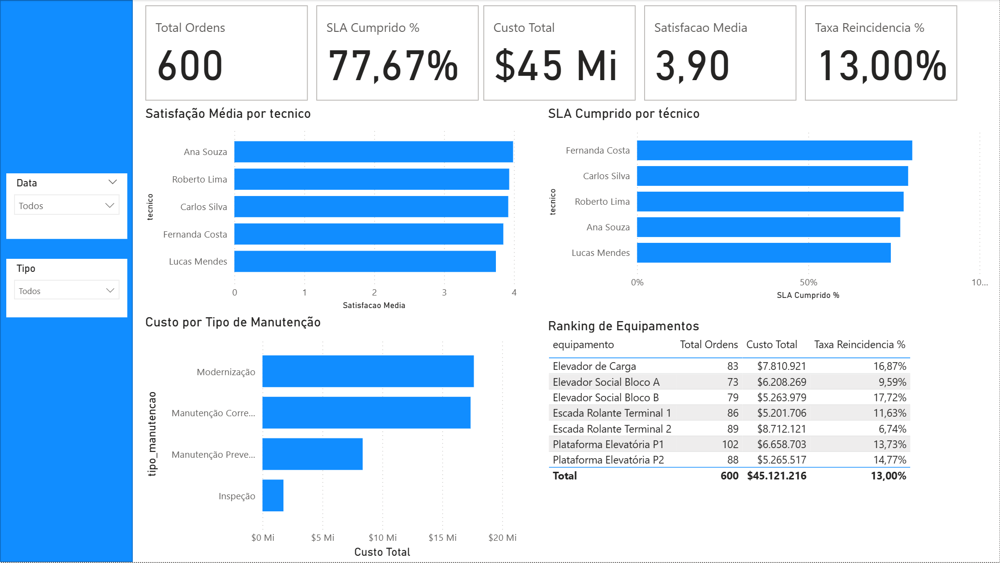
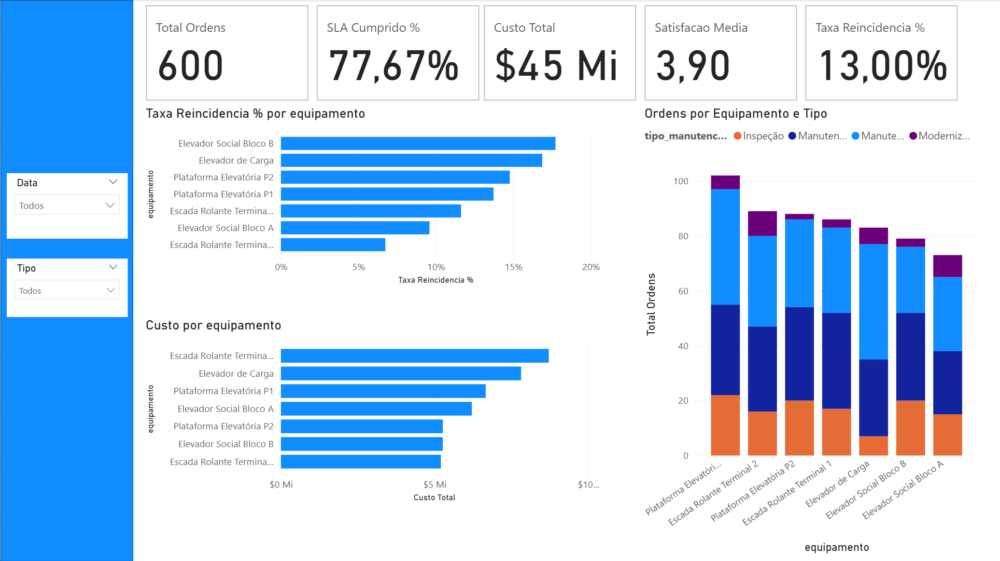
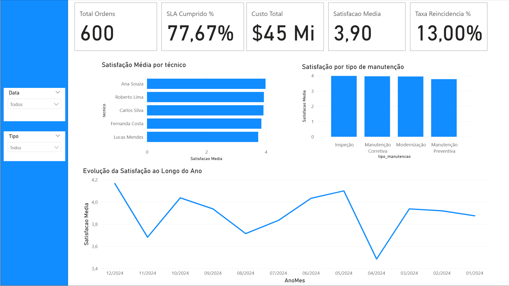

# Dashboard de Manutenção e Confiabilidade - Power BI

Dashboard interativo para monitoramento de ordens de manutenção de equipamentos industriais (elevadores, escadas rolantes e plataformas), com foco em SLA, custos, performance por técnico e confiabilidade dos equipamentos.

---

## Problema de negócio

Empresas de manutenção industrial precisam controlar centenas de ordens de serviço simultaneamente. Este dashboard responde perguntas críticas como:

- Qual o percentual de ordens concluídas dentro do SLA?
- Quais equipamentos geram mais custos e reincidências?
- Como está a satisfação dos clientes por técnico?
- Qual a distribuição de preventiva vs corretiva ao longo do ano?

---

## Tecnologias utilizadas


---

## Estrutura do projeto

```
dashboard-manutencao/
│
├── dados/
│   └── ordens_manutencao.csv   # 600 ordens de manutenção fictícias
├── gerar_dados_manutencao.py   #script Python que gera o dataset
├── dashboard_manutencao.pbix   #arquivo Power BI (após criação)
└── README.md
```

---

## Como executar

**1. Gerar o dataset**

```bash
pip install pandas numpy
python gerar_dados_manutencao.py
```

**2. Abrir no Power BI Desktop**

- Abra o Power BI Desktop
- Vá em `Página Inicial → Obter Dados → Texto/CSV`
- Selecione o arquivo `dados/ordens_manutencao.csv`
- Clique em `Carregar`

---

## KPIs do dashboard

| Indicador            | Descrição                                    |
| -------------------- | -------------------------------------------- |
| Total de ordens      | Contagem geral de OS abertas no período      |
| SLA cumprido %       | Ordens concluídas dentro do prazo contratado |
| Custo total R$       | Soma dos custos de todas as ordens           |
| Satisfação média     | Média das avaliações dos clientes (1–5)      |
| Taxa de reincidência | % de equipamentos com falha recorrente       |

---

## Páginas do dashboard

1. ### Visão Geral - KPIs principais + gráfico de ordens por mês
2. ### Performance - Cumprimento por tipo de manutenção e por técnico
3. ### Equipamentos - Ranking de equipamentos por custo e reincidência
4. ### Satisfação - NPS e avaliações por técnico e cliente

---

_Projeto desenvolvido por [Vinicius Degelo](https://linkedin.com/in/vinicius-degelo) como parte do portfólio de Análise de Dados & BI._
